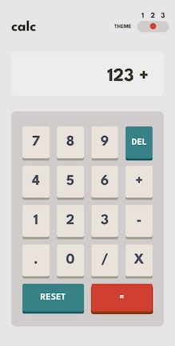
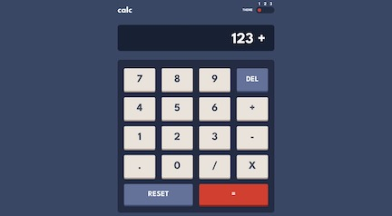

# Frontend Mentor - Calculator app solution

This is a solution to the [Calculator app challenge on Frontend Mentor](https://www.frontendmentor.io/challenges/calculator-app-9lteq5N29). Frontend Mentor challenges help you improve your coding skills by building realistic projects.

## Table of contents

- [Overview](#overview)
  - [The challenge](#the-challenge)
  - [Screenshot](#screenshot)
  - [Links](#links)
- [My process](#my-process)
  - [Built with](#built-with)
  - [What I learned](#what-i-learned)
- [Author](#author)
- [Acknowledgments](#acknowledgments)

## Overview

### The challenge

Users should be able to:

- See the size of the elements adjust based on their device's screen size
- Perform mathmatical operations like addition, subtraction, multiplication, and division
- Adjust the color theme based on their preference
- **Bonus**: Have their initial theme preference checked using `prefers-color-scheme` and have any additional changes saved in the browser

### Screenshot

### Links

- Solution URL: [Zacharycampanelli/React-Calculator](https://github.com/Zacharycampanelli/React-Calculator)
- Live Site URL: [campanelli-react-calc.netlify.app](https://campanelli-react-calc.netlify.app/)

## My process

### Built with

- Flexbox
- Grid
- Material UI
- React
- Javascript
- Mobile-first workflow
- Netlify

## Author

- GitHub: [Zacharycampanelli](https://github.com/Zacharycampanelli)
- Frontend Mentor - [@Zacharycampanelli](https://www.frontendmentor.io/profile/Zacharycampanelli)
- Email: [zaccamp@optonline.net](mailto:zaccamp@optonline.net)

## Acknowledgments

- [Frontend Mentor](https://www.frontendmentor.io)
